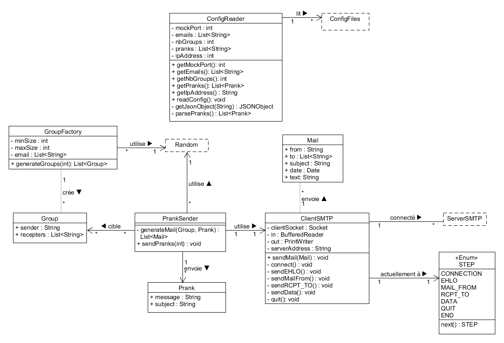

# Teaching-HEIGVD-RES-2021-Labo-SMTP

## Description

PrankSender est un programme vous permettant d'envoyer des blagues par email en vous faisant passer pour quelqu'un d'autre.

Il est très simple d'utilisation et ne demande pas de connaissances particulières. 

## Configuration

Toute la configuration se trouve dans le dossier config (client/resources/config). Elle est composée de 3 fichiers au format [JSON](https://en.wikipedia.org/wiki/JSON) : 

- emails.json : Contient la liste des emails des victimes [emails], ainsi que le nombre de groupe de victimes à former [number_of_groups].
- server_config.json : Configuration concernant le server SMTP à qui les blagues seront envoyées. Contient adresse du server [ip_address] et le port de connexion [port].
- pranks.json : Contient une liste de blagues qui vont être envoyées. Chaque blague est constituée  d'un sujet et d'un message.

Vous pouvez modifier les données de configuration, mais la structure doit restée la même, sinon le programme ne fonctionnera pas.

De plus, la présence de 3 emails minimum (taille des groupes minimum) et d'au moins une prank est requise.

## Utilisation & tests

Une fois les fichiers de configuration prêts, vous pouvez simplement exécuter la commande suivante  `java -jar target/prank-sender-1.0-SNAPSHOT-standalone.jar` depuis le dossier "Client". L'envoi des blagues sera alors fait automatiquement.

Si vous souhaiter faire des tests avant d'envoyer de réelles blagues, nous avons inclus un serveur MockMock de test que vous pouvez utiliser. Il se trouve dans le dossier "Docker_Mock". Il s'agit d'un serveur tournant sur [Docker](https://www.docker.com/). Pour le lancer, vous aurez besoin d'une installation docker.

#### Procédure pour effectuer un test :

Lancer docker

Allez dans le dossier "Docker_Mock" et lancer les deux commandes suivantes : `./build-image.sh` suivi de  `./run-container.sh`.

Configurer l'application pour utiliser l'adresse ip 127.0.0.1 et le port 8281

Lancer l'application (`java -jar target/prank-sender-1.0-SNAPSHOT-standalone.jar`) depuis le dossier "Client". Les emails seront envoyés au serveur MockMock

Connecter vous avec votre navigateur à l'adresse `http://localhost:8282/`. La liste des emails reçu par MockMock y est consultable.

## Implémentation

L'application est constituée des classes suivantes :

- ConfigReader s'occupe de lire les fichiers de configuration et de retourner les valeurs nécessaires.
- GroupFactory constitue les groupes des victimes de manière aléatoires.
- Group représente un groupe de victime  (un expéditeur et minimum deux destinataires)
- PrankSender est responsable de créer des mails de prank pour les groupes, et demande leur envoi
- Prank représente une blague (avec un sujet et un texte)
- Mail représente un mail qui va être envoyé (expéditeur, destinataire, sujet, date, texte)
- ClientSMTP envoi un mail en suivant le protocole SMTP.
- STEP représente l'étape actuelle de l'envoi du mail

## Exemple d'un dialogue Client-Serveur

En bleu les réponses du serveur, et en rouges celle du client.

